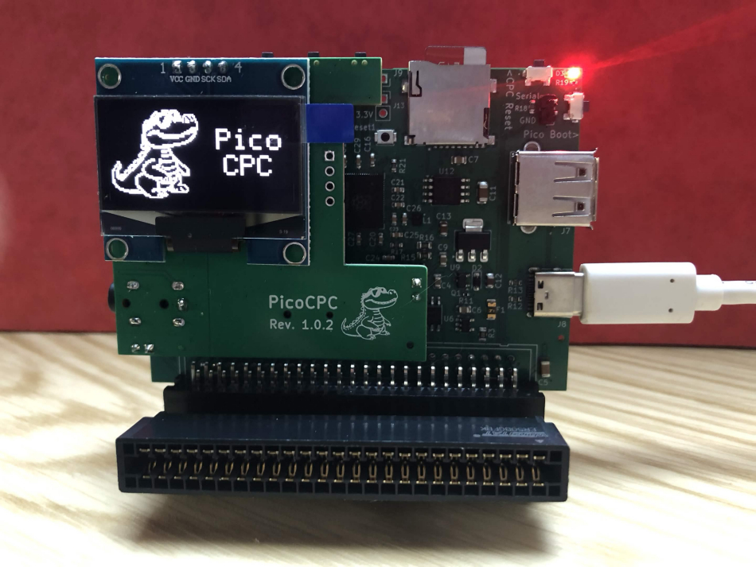
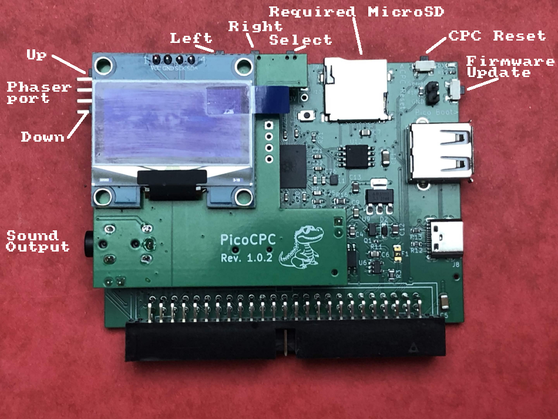
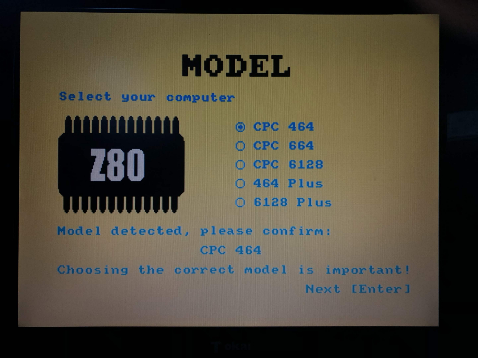
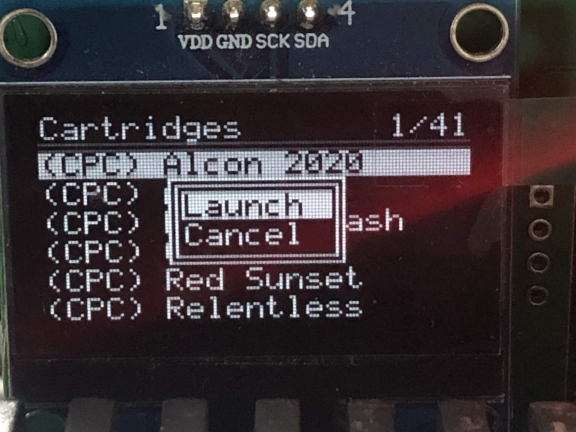

# PicoCPC - An Amstrad CPC 464/664/6128 and Amstrad 464+/6128+ expansion  

## What is the PicoCPC  

The PicoCPC is an expansion connecting to the CPC edge or centronic expansion port with an adapter and is in MX4 format.  
The PicoCPC replaces many expansions in one card with low power usage.  

  

## 1) Purpose
The PicoCPC is an addon card connecting to the expansion port of Amstrad CPC family of computers. This consists of:
+ CPC 464
+ CPC 664
+ CPC 6128
+ Amstrad 464 Plus
+ Amstrad 6128 Plus

It provides:
+ A  set of 2 floppy disk drives on all the family listed above, including ones with a built-in floppy disk drive with support of the folowing protections:
  + Speedlock / weak sectors
  + GAP2 / oversize sectors
  + Infogrames / Loriciel gap + overrun
+ From 0 to 1024kb of extended memory using Yarek mode above 512kb. Supported by SimbOS and FutureOS.
  + 100% compatible with Amstrad 464 and 6128 Plus  
+ C3 memory mode perfect emulation for CPC 464, CPC 664 and 464 Plus.
+ Up to 16 roms.
+ CPR cartridge loading for Amstrad plus, but also for regular CPC for few regular CPC converted games for GX4000 and Alcon 2020. 
+ Playcity dual PSG sound card emulation including timer and counter with NMI activation on Cursor count or time passed.
  It does not support the 2 linked counters yet.
+ Nova RTC emulation including 32kb of NVRAM, supported by FurureOS, SymbOS 4.0 and UniDOS.
+ Physical floppy disks copy to eDSK on machines with built-in floppy disk drive or DDI.
+ Hard-disk rudimentary emulation, CH376 emulation planned but not done yet.
+ Optional CPC sound output to the jack supporting PCM output, Amstrad Plus DMA sound will be missing since not available on the port.  
+ Optional Willy OPL2/OPL3 emulation.  

The GX4000 console is not supported since it does not have the required expension port.

## 2) What is the PicoCPC hardware
The PicoCPC has the name suggest is built around a RaspBerry Pi Pico 2 RP2350B, a 80 pins chip with 48 GPIO, 2 cores, 3 programable PIO and 512kb of memory.
All the connexions to the CPC interface are protected behind a buffer, multi-plexors or logic chips in order to work with 3.3v signals only.
A 1Mb SRAM chip is added to the board to provide the memory expension to the CPC and store CPR cartridge images.
It has a USB-C port to update the firmware, a USB-A port for USB keys, a programing button and a CPC reset button.
The card exposes 4 pins for a light phaser for use with CRT screen.
The main card provides I2S and I2C signal on a connector for the daughter board.

The daughter board contains an RTC I2C chip, an I2C GPIO expender chip for the led and 5 buttons and an I2S DAC chip for sound output.

  

## 3) Availability

The PicoCPC is not yet available to purchase. A first batch of 50 is currently privately distributed in order to discover and fix the firmware.  

## 4) Using the PicoCPC from the computer

A SD card is required to use the PicoCPC. If the PicoCPC is started without a SD card, it will display a message on the Oled screen to insert a SD card.

### a) First use with a blank SD card
When the PicoCPC is first started, it detects no configuration file is present on the SD, it then starts th Wizard graphical interface.
After choosing the language, you will be asked for memory configuration and keyboard language, then the configuration will be created for the specific CPC in use.
The configuration file name contains the detected machine model and will be named for exemple 6128.cfg.
Then if the PicoCPC is plugged to another model, Wizard will run again and save another configuration for this new model.

When the wizard completes, folder structure is automatically created on the SD and few roms are saved in the ROM folder.
These ROMs are Custom CPC6128 OS, Basic 1.1, AMSDOS 0.7 and Fruity Frank.

 

### b) Regular use
The choice has been made to use the same set of ROMs on all the different models.
ROMs started by default overriding the CPC roms:
+ OS + Basic 1.1 altered to run on CPC464, to display the chosen amount of memory and to map your keyboard.
+ On CPC464 and Amstrad Plus computers, the DOS ROM is also loaded to support floppy disk drives.
The default overriding can be changed by editing the respective .cfg file in the root folder of the SD, then OS and basic of the CPC are used.
The PicoCPC also comes with a special ROM with commands, a basic help for these commands can be accessed from the computer by using |help
Another utility command is |info which displays the Basic PicoCPC configuration like detected model, emulated model and emulated memory amount.
+ If you have a faulty DOS ROM on a CPC 664 or 6128, you can edit the configuration and add the DOS ROM in slot 7 to override the one in the machine. And yes it also works on 6128.

### c) Disk drive commands
The virtual floppy system supports regular dsk and edsk file types, up to 2 sides and 80 tracks, this means special 720kb or 1200kb floppy disks are also supported.  
When a USB stick is plugged to the PicoCPC, floppy disk images from the USB stick will be used instead of the ones on the SD card.  
`|DCAT[,"expression"]`: List the DSK (*.dsk) files in FLOPPY folder on the SD card or USB stick root folder, along with a number.  
	Result can be filtered using * or ? like `|DCAT,"*fight*` or `|DCAT,"p?n*`    
`|DLOAD, number[,"B"]`: Exemple:  
`|DLOAD,21,"B"` will load the disk with number 21 (see command above) in virtual drive B:  
`|DLOAD,21` will load the disk with number 21 in virtual drive A:  
	After this command is issued, A: or B: drive can be used like if a real floppy disk was inserted in the drive.  
`|DGP[,"B"]`: Enable floppy disks grouping on the drive. Imagine you want to play a game that uses 2 floppy disk images and supports only drive A:  
	You would then use these commands as exemple: `|DGP` `|DLOAD,12` `|DLOAD,13`. The PicoCPC will load floppy number 12 is drive A: and record the disk 13. You can then CAT and RUN the game launcher. When the game asks for the second floppy, press on the Select button on the daughter board, the the PicoCPC will switch to floppy disk 13. If you press Select again, disk number 12 will be put back in the virtual drive. This is not limited to 2 images, up to 10 images can be preloaded. Then if disks x, y and z and selected, pressing the Select button will circle x, y, z, x, y, z...  
`|DRESET`: Delete all grouping  
`|DEJECT[,"B"]`: Remove the image in the virtual drive. Drive 'A' by default without parameter.  
`|DCOPY,"Name"`: Create a copy of the physical disk to dsk file named Name.dsk. Disk copy is slow but able to copy some protections.  
Virtual floppy support sector writing (so save any file), but writing/formating of tracks is not yet implemented.  

 Commands to use with caution  
`|DOFF`: Disable the floppy emulation, only useful on CPC664, CPC6128 and 6128 Plus, on other machines, this would lead to a CPC hang so the PicoCPC prevents it. This allows the use the internal physical floppy after the virtual floppy was used.  
`|DON`: Enable back virtual floppy emulation. The PicoCPC knows when to enable the virtual floppy, for exemple when |DLOAD is issued.  

### d) Cartridges commands
Cartridges are designed for Amstrad Plus computer, but regular CPC can also benefit from cartridges.  
`|CCAT[,"expression"]` lists available cartridges in CPR (*.cpr) format in the Cartridge folder on the SD card, along with a number. see `|DCAT` for possible filtering espressions.   
`|CRUN,number` will load and launch the cartridge. Cartridges are loaded in the upper half of the SRAM, this will then limit the expension memory to 512kb automatically when a cartridge is launched. the transfer of the cartridge to the SRAM is done by the computer and a raster effect is displayed in the border during this time.  

Few cartridges with no Plus specific requirement car be run on regular CPC. Alcon 2020 is one of them, some games available in floppy format, packaged in cartridge format for the GX4000 can run on regular CPC.  

### e) ROM commands
`|RLIST` show the ROMs currently managed by the PicoCPC.   
`|RCAT[,"expression"]` list ROMs available in the ROM folder on the SD-Card. Filters work like for DCAT and CCAT.   
`|RLOAD,x,y` Load ROM with number x given by the `|RCAT` command in slot y.  

### f) Hard-disk commands
A set of commands and managed by the PicoCPC rom to give access to a virtual experimental HDD.  
`|CAT` will list the content of the current path. The root folder is the HDD folder on the SD card.  
`|CD,"foldername"` or `|CD,".."` will change the current folder to the subfolder "foldername" or go back one folder below.  
`|RUN,"name"` loads and runs a basic or binary program  
`|LOAD,"name"[,addr]` loads a basic program or a binary program with optional target memory address  
Writing to the virtual HDD is not yet implemented.  
Running basic program does not work reliably. Often you will have to type run to launch it.  

`|PLAY,"name"` will play the VGM file "name.vgm" using the emulated dual PSG or OP2/3. This supports more modes than the Playcity does in PSG.  
You do not have to type the .vgm extension, but you can.  

### g) Time commands
`|TIME` will return the current date and time. When RTC is not yet configured, this will return the date the PicoCPC firmware was compiled.  
`|SETTIME,"YYYY-MM-DD hh:mm:ss"` will set the date and time and configure the RTC to this date and time.  

### h) Various commands
`|RESET` Simply resets the computer  
`|NOVAOFF` Disable the NovaRTC temporarily to load SymbOS since the support for this card is broken in SymbOS 4.0.  
`|NOVAON` Activate NovaRTC temporarily until the PicoCPC is restarted.  

## 5) Using the PicoCPC with Oled screen and buttons
There is 5 buttons on the daughter board to control the oled screen.  
The 3 top buttons are from left to right: previous, next, select. 2 more buttons are present on the left side, these buttons are up and down.  
Press either Previous or Next button to call the screen functions. Navigate to floppy disk tab, rom or cartridges tab with Next and previous buttons.  
Navigate in the lines with Up and Down button and select the element with Select button.  
A sub-menu then appears, use Up or Down to select your choice and click Select to validate.  

 

ROM selection screen is not coded yet.  

## 6) Technical information for programmers
### a) I/O port used
The PicoCPC card listens to the I/O port #FBF2, no other port is used. Everything is sent on this port, commands and data. Checks on valid combinations is done mainly by the PicoCPC ROM, very few checks are done by the PicoCPC firmware, so be careful or the firmware will crash.  

After each command is sent, the I/O port #FBF2 is holding the status and it must be read until the return value is different from 1.  
Return values are as follows:  
+ 00: Ready  
+ 01: Work in progress  
+ 02: Error  
Whenever the returned value is an error (2), a 0 must be sent to this I/O `#FBF2` to confirm the error and resume operations, status will then return back to 0.  

### b) Data exchange between the computer and the PicoCPC
The PicoCPC ROM is used for many small data transfer from the PicoCPC to the computer. The last 4kb of the ROM are populated by the PicoCPC and read by the computer. Cartridges are an exception since they are far more larger, in this case a dedicated ROM, 16kb in size, is used temporarily.  
For data transfer from the computer to the PicoCPC, the I/O port `#FBF2` is used.  
The PicoCPC has no access to the computer memory, then its ROM is the interface.  
Configuration file created by the Wizard contains comments to explain the settings.  

## 7) configuration files

The configuration done by the Wizard only sets up the standard features.  
More function are available for you to activate in the configuration.  

This includes:  
+ CPC sound output via the Jack port on the card. This even outputs digitalized voices or music. The option is called `[PSG]`.  
+ NovaRTC complete emulation, it provides a saved time clock. To have time saved, install a CR2520 battery in the slot on the back of the daughter board. You will need to unplug it from the main card. The option is called `[RTC]`.  
+ Willy OPL2 and OPL3 emulation. To option is `[OPL]`.  
+

    [CPC]  
    M=464  
    # possible values : 464, 664, 6128, 464+, 6128+  

    [ROM]  
    L=OS (slot L).rom  
    0=BASIC 1.1 (slot 0).rom  
    5=PicoCPC  
    7=AMSDOS_0.5 (slot 7).rom  

    [LNG]  
    LANG=FR_PIPE  
    # Possible values are EN, FR, FR_PIPE, ES, this will set the proper keyboard mapping and layout  
    # FR_PIPE is a special variant only for French keyboard to replace ù by |  

    [RAM]  
    EXP=64  
    # Expanded memory amount, can be 64, 128, 192, 256, 320, 384, 448, 512, 960 or 1024  

    [PSG]  
    Emulate=1  
    # Get CPC sound emulated on the PicoCPC sound output  
    # 0 to disable, 1 to enable  

    [RTC]  
    Emulate=0  
    # Nova RTC emulation with NVRAM  
    # 0 to disable, 1 to enable  

    [OPL]  
    Emulate=1  
    # OPL3 emulation  
    # 0 to disable, 1 to enable    

Lines beginning with `#` are comments and ignored by the PicoCPC.  

## 8) About me

You can find me on [Discord](https://discord.gg/ZXy3TZMSrj)  
My Youtube channel [https://www.youtube.com/@RodrikStudio](https://www.youtube.com/@RodrikStudio)  

Rodrik Studio  

## 9) Greetings

Many thanks to Edouard BERGE for his [RASM compiler](https://github.com/EdouardBERGE/rasm) I used to make the CPC roms and also for his big help with the Z80 assembly.  
Many thanks to FreddyV (the creator of the [PicoMEM](https://github.com/FreddyVRetro/ISA-PicoMEM)) for the help with component placement and selection and BOM creation.  
